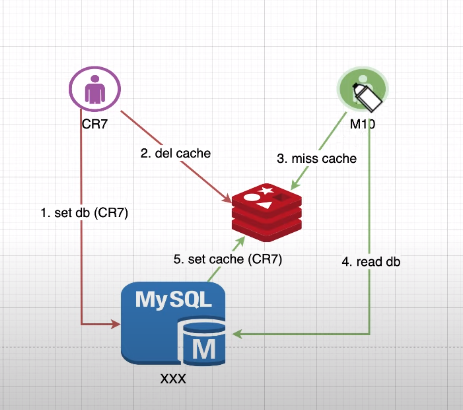

### Note: 
- Sử dụng Delete cache tốt hơn Set cache
- Trường hợp đọc ghi liên tục gây ra lệch giữa Cache và Database => Xử lý ??

### Problem: 
- cache avalanche: Lở cache =>  Lượng lớn Data trong cache hết hạn cùng lúc hoặc cache chết -> Lượng lớn req vào db gây quá tải
- cache breakdown: Sự cố phá vỡ trong bộ nhớ cache => Cache hết hạn và có rất nhiều tìm kiếm trên cache này => Lượng lớn req vào db gây quá tải
- cache penetration: Thâm nhập bộ nhớ cache => Spam tìm kiếm data không tồn tại trong DB và cache -> Db quá tải

